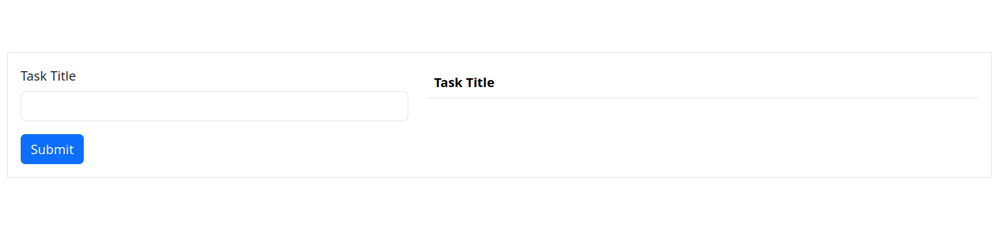

# Todo-list

## Overview

This is a todo-list which adds a new title and displays the list made using Django Rest Framework and HTML/CSS, Bootstrap, jquery

## Table of Contents

- [Requirements](#requirements)
- [Setup](#setup)
- [API Endpoints](#api-endpoints)
- [Frontend] (#frontend)

## Requirements

- Python 3.x
- Django 4.x or higher
- Django REST Framework 3.x or higher
- MySQL

## Setup

1. **Clone the repository:**
   ```bash
   git clone https://github.com/anjali31017/todo-list.git
   
2. **Create a virtual environment:**
    python -m venv venv
    source venv/bin/activate # On Windows use `venv\Scripts\activate`

3. **Install dependencies:**
    pip install -r requirements.txt

4. **Set up the database:**
    Update the database settings in settings.py.
    Run migrations:
        python manage.py makemigrations
        python manage.py migrate

5. **Run the development server:**  
    python manage.py runserver

6. **Run the frontend:**  
    browse to frontend folder
    python -m http.server 5500

## API Endpoints

1. TaskView

    POST /task-create/: Add a new task.
        URL: http://127.0.0.1:8000/task-create/
        Request Body: { "title": "task1"}

    GET /task-list/: List all books, optionally filtering by availability.
        URL: http://127.0.0.1:8000/task-list/


## Frontend




